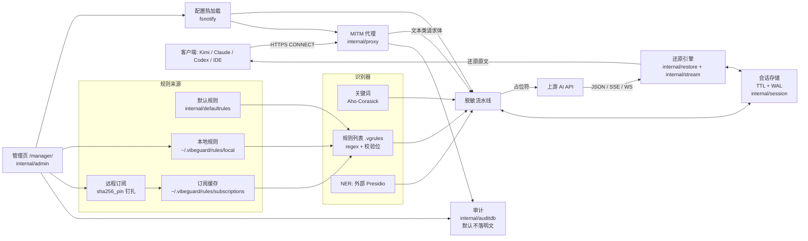
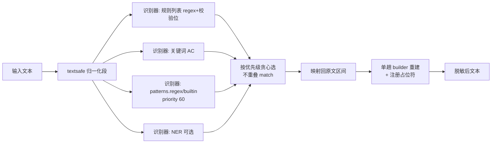

# VibeGuard 技术文档

面向开发者的架构与实现细节。使用说明见根目录 [README.md](../README.md)；规则语法见 [RULE_LISTS.md](RULE_LISTS.md)；LLM 编码代理的工作约定见 [AGENTS.md](../AGENTS.md)。

## 目录

- [架构总览](#架构总览)
- [请求路径：脱敏](#请求路径脱敏)
- [响应路径：还原](#响应路径还原)
- [模块一览](#模块一览)
- [关键机制](#关键机制)
  - [文本归一化（textsafe）](#文本归一化textsafe)
  - [关键词匹配（Aho-Corasick）](#关键词匹配aho-corasick)
  - [脱敏流水线（pii_next）](#脱敏流水线pii_next)
  - [结构化 JSON 脱敏（promptredact）](#结构化-json-脱敏promptredact)
  - [Content-Type 门控与嗅探](#content-type-门控与嗅探)
  - [占位符格式与校验位](#占位符格式与校验位)
  - [会话存储与 WAL](#会话存储与-wal)
  - [SSE 流式还原](#sse-流式还原)
  - [WebSocket 加固](#websocket-加固beta)
  - [审计与安全](#审计与安全)
  - [规则订阅完整性](#规则订阅完整性)
  - [NER](#ner)
- [配置参考](#配置参考)
- [构建与测试](#构建与测试)
- [新增 CLI 助手适配指南](#新增-cli-助手适配指南)

## 架构总览



## 请求路径：脱敏

```
客户端                代理 (internal/proxy)                     上游
  │  CONNECT host:443     │                                      │
  │──────────────────────►│  shouldIntercept(host)?              │
  │                       │   ├─ 否 → 盲隧道透传 (note=pass_through)
  │                       │   └─ 是 → MITM：CA 现场签证书          │
  │  TLS(伪造证书)         │  TLS(系统根证书校验上游)               │
  │◄─────────────────────►│◄────────────────────────────────────►│
  │  HTTPS 请求            │                                      │
  │──────────────────────►│  handleHTTP (OnRequest)              │
  │                       │   1. 门控: 方法/Content-Type/大小(10MB)│
  │                       │      · isTextContent: mime 解析,       │
  │                       │        json/+json/xml/text*/form       │
  │                       │      · 缺 content-type → 嗅探 JSON     │
  │                       │        (note=content_type_sniffed)     │
  │                       │      · multipart/form-data → 按 part   │
  │                       │        脱敏, 二进制 part 透传           │
  │                       │   2. 脱敏 (见下方分支)                 │
  │                       │   3. 记审计 (命中数 + preview)         │
  │                       │─────────────────────────────────────►│
  │                       │                                      │
```

脱敏分支（`applyConfig` 装配，按请求体形态选择）：

```
请求体
  │
  ├─ 是 chat-API JSON ──► promptredact.RedactJSONBody
  │                        按字段路径精准脱敏: messages[].content
  │                        (含 content parts 数组)、system、
  │                        tool calls / tool 结果等
  │                        │
  │                        └─ 替换后 JSON 非法? ──► invalid_json_policy
  │                             · partial(默认): 只跳过"搞坏 JSON"的
  │                               那几条命中, 其余照常脱敏
  │                             · allow: 放行原文 · block: 拒绝请求
  │
  └─ 其他文本 ──► pii_next pipeline（或 legacy redact 引擎）
                   1. textsafe.FoldSegments 归一化
                   2. 各识别器产出 match(区间+类别+优先级)
                   3. 按优先级贪心选不重叠区间
                   4. 单趟 builder 重建文本, 命中处换占位符
```

## 响应路径：还原

```
上游                  代理 (internal/proxy)                      客户端
  │                     │                                        │
  │  响应               │  OnResponse                            │
  │────────────────────►│   ├─ Content-Encoding: gzip/br/… → 解压 │
  │                     │   ├─ text/event-stream (SSE) ──────────►│ stream.Reader
  │                     │   │    逐事件处理; textStreamRestorer    │   逐事件、跨 chunk
  │                     │   │    持有"半个占位符"尾巴到下一 chunk  │   还原
  │                     │   │    chat completions / tool-call      │
  │                     │   │    delta 按流 key 隔离还原           │
  │                     │   ├─ 整包 JSON → restore.Engine.Restore  │
  │                     │   │    + FindLeftovers 残留检测          │
  │                     │   │    (审计 note=unrestored_placeholders)│
  │                     │   └─ WebSocket 升级 → wsproxy            │
  │                     │        .TransformConn (见下文)           │
  │                     │────────────────────────────────────────►│
```

## 模块一览

| 包 | 职责 |
|---|---|
| `cmd/vibeguard` | CLI（cobra）：start/stop/run/各助手子命令/init/trust/test/version；含 zh/en 两套 init 配置模板 |
| `internal/proxy` | MITM 核心（goproxy）：CONNECT、拦截模式、请求/响应门控、脱敏/还原装配、审计发射、配置热加载 |
| `internal/promptredact` | chat-API JSON 体的结构化按字段脱敏 |
| `internal/pii_next` | 新一代脱敏流水线：归一化 → 多识别器 → 优先级贪心选择 → 单趟重建 |
| `internal/redact` | 传统关键词引擎（同样走归一化与单趟重建） |
| `internal/textsafe` | 文本归一化：零宽字符剔除、NFKC、大小写折叠，并维护"折叠区间 ↔ 原文区间"映射 |
| `internal/ahocorasick` | AC 自动机关键词匹配器；转移表为排序数组+二分，根节点 256 直查表 |
| `internal/restore` | 占位符还原引擎（整包/正则扫描）；校验位验证、残留检测 `FindLeftovers` |
| `internal/stream` | SSE 流式还原：逐事件、跨 chunk 续接、delta 流隔离；`MessageRestorer`（跨消息还原，供 WebSocket 用） |
| `internal/session` | 占位符 ↔ 原文映射：TTL、LRU 上限、AES-GCM 加密 WAL（批量 fsync + 自动压缩） |
| `internal/rulelists` | `.vgrules` 解析（keyword/regex/校验位验证器）与 HTTPS 订阅管理（sha256 钉扎） |
| `internal/defaultrules` | 内置 `default.vgrules`（邮箱/电话/身份证/银行卡/密钥等，含校验位规则） |
| `internal/secretsources` | 从 dotenv/逐行文件导入 secret 为关键词 |
| `internal/admin` + `internal/auditdb` | 管理 UI/API（bcrypt 鉴权 + 登录防爆破 + 元审计）；内存审计，可选 SQLite（构建 tag `vibeguard_full`） |
| `internal/cert` | CA 生成/信任安装；关键词落盘加密密钥由 CA 私钥派生 |
| `internal/wsproxy` | WebSocket 帧级脱敏/还原（beta）：permessage-deflate 解压、协议校验、失败回调 |
| `integrations/kimi-code-vibeguard` | Kimi Code 预检插件（Node hook 脚本，无 Go 代码） |

## 关键机制

### 文本归一化（textsafe）

对抗"视觉不可见"的绕过手段：匹配前 `textsafe.FoldSegments` 把输入折叠为若干归一化段（剔除 U+200B 等零宽字符、NFKC 折叠全角字符、可选大小写折叠），并保留每段"折叠后区间 → 原文区间"的映射。识别器在折叠文本上匹配，替换时映射回原文区间——因此 `pass​word`（夹零宽字符）、`１３８…`（全角数字）、大写变体都照常命中，而写回的仍是原始字节。

### 关键词匹配（Aho-Corasick）

`internal/ahocorasick` 是纯粹的字串匹配器（不做归一化，归一化由调用方在 textsafe 层完成）。性能要点：转移表从 `map[byte]int` 改为**排序数组 + 二分查找**，根节点另加 256 项直查表，长文本扫描的缓存友好度显著更好。匹配语义：非重叠最左最长、支持早停。

### 脱敏流水线（pii_next）



- `proxy.patterns.regex` / `patterns.builtin` 通过 `proxy.buildInlineRuleRecognizers` 接入同一条流水线（不再是死配置）。
- NER 调用失败会计数（stats 的 `ner_failures`），失败时静默回退到规则/关键词。

### 结构化 JSON 脱敏（promptredact）

chat API 请求体不整文脱敏，而是按 JSON 字段路径定位"prompt 文本"再脱敏，避免误伤参数名/元数据：

- 覆盖：`messages[].content`（字符串与 content parts 数组两种形态）、`system`、`tool_calls`/`function_call` 参数、tool 结果等。
- `<system-reminder>` 包裹的文本**不豁免**——历史豁免会让系统提醒里的密钥漏到上游，已删除该特例。
- 替换导致 JSON 非法时按 `proxy.invalid_json_policy` 处理：`partial`（默认）只撤销搞坏 JSON 的那几条命中，其余保留脱敏；`allow` 放行原文；`block` 拒绝请求。回退事件记入审计 note。

### Content-Type 门控与嗅探

- `isTextContent` 基于 mime 解析而非字符串前缀：`application/json`、`+json` 后缀、`text/*`、`xml`、`x-www-form-urlencoded` 等进入扫描；其余透传。
- 请求缺 Content-Type 时嗅探 body 是否像 JSON（`looksLikeJSONBody`），是则照常脱敏并记审计 note `content_type_sniffed`——与响应侧的 SSE 嗅探对称。
- `multipart/form-data` 按 part 拆分：文本 part 脱敏、二进制 part（文件上传）原样透传，boundary 保持不变（`internal/proxy/multipart.go`）。
- 请求体大小上限 10MB。

### 占位符格式与校验位

```
__VG_<CATEGORY>_<hash12><checksum2>__
│     │           │        │
│     │           │        └─ 2 位 hex 校验位, 由 (原文, 类别, hash12) 派生
│     │           └─ 12 位 hex: 原文+类别的哈希前缀
│     └─ 类别: [A-Z0-9_]
└─ 前缀可通过 proxy.placeholder_prefix 配置
```

- 还原时校验位不通过即视为"长得像占位符的普通文本"，不替换、不报错。
- 旧格式（12 位 hex 无校验位）仍可还原，保证 WAL 里旧映射兼容。
- 整包 JSON 响应还原后跑 `restore.FindLeftovers`：只把**校验位确认**的残留占位符记入审计 note `unrestored_placeholders`（提示映射丢失：TTL 过期/驱逐/会话清空），不误报相似文本。
- 正则匹配用代码侧尾部边界检查（RE2 无 lookahead），避免 `__VG_EMAIL_xxx__suffix` 这类粘连误还原。

### 会话存储与 WAL

`internal/session.Manager` 保存 占位符 ↔ 原文 映射：

- `GetOrCreatePlaceholder(original, category, prefix)` **单次持锁原子化**——同一原文并发脱敏只产生一个占位符，无检查-再注册的竞态窗口。
- TTL（默认 30m）+ 最大映射数（默认 10 万，LRU 驱逐）。
- WAL 用 AES-GCM 加密落盘（密钥派生自 CA 私钥），重启后恢复映射。
- 批量 fsync：`SetAsyncFlush` 按 `session.wal_sync_interval`（默认 200ms）或 64 条批量刷盘，崩溃窗口内有界；WAL 超过 `session.wal_compact_bytes` 自动压缩重写。

### SSE 流式还原

`internal/stream.Reader` 逐事件处理 SSE，难点是**占位符可能被拆到两个 chunk 里**：

```
chunk1: ..."text": "联系我 __VG_EM      ← 半个占位符, 不能发
chunk2: AIL_9811f8394a1628__", ...      ← 拼接后才能还原

textStreamRestorer.Feed:
  1. buf = 存量尾巴 + 新 chunk
  2. safeEmitCut(buf) 找安全切点:
     - 末尾含完整前缀但占位符未闭合 → 从前缀处扣住
     - 末尾是前缀的片段(如 "__V") → 扣住片段
     - 完整占位符贴尾但缺 "__" 后缀 → 扣住等下一 chunk
  3. 切点之前 Restore 后发出, 尾巴留给下次 Feed
```

- chat completions / tool-call 的增量 delta 按流 key 隔离还原（不同 tool call 的 delta 不互相污染）。
- 已知修复：`Feed` 在 Restore 无命中时返回的是 buffer 别名切片，须先拷贝再平移尾巴，否则输出被污染。

### WebSocket 加固（beta）

`proxy.websocket_redaction_beta: true` 时，升级后的连接包一层 `wsproxy.TransformConn`（上行脱敏、下行还原）：

- **permessage-deflate 主动解压**：握手阶段代理会尝试剥掉客户端的扩展协商；若上游仍协商了压缩，带 RSV1 的文本消息（含分片消息）会被缓存整条 → flate 解压（追加 `00 00 ff ff` 同步尾，上限 32MiB）→ 脱敏/还原 → 以**未压缩帧**转发（RFC 7692 允许逐消息不压缩）。对端启用 context takeover（跨消息回引）会导致解压失败，此时该方向退化透传。
- **帧协议校验**：RSV2/RSV3 置位、控制帧分片/超长（>125B）、未知 opcode 都是硬错误。
- **失败可观测**：解析/转换失败触发 `SetOnError` 回调一次（每方向），记 `slog.Warn` + 审计 note `ws_frame_parse_error`，该方向随后透传。
- **跨消息还原**：下行经 `stream.MessageRestorer`，占位符拆在两条消息里也能还原。
- 控制帧、二进制帧、带未知 RSV 位的帧一律透传。

### 审计与安全

- **默认不落明文**：审计事件只记录命中类别、次数、来源规则（`source`，如 `rulelist:<列表名>` / `keywords` / `ner-presidio`）和 `previewValue`（前 2 位…后 2 位）；`audit_db.persist_raw_values: true` 才会持久化原文（默认 false）。审计文件权限 `0600`。
- **元审计**：管理端操作（改配置/规则/关键词等）记录操作者、动作、时间。
- **登录防爆破**：`/manager/` 登录连续失败指数退避锁定。
- **CSRF 防护**：管理 API 写操作（非 GET/HEAD/OPTIONS）必须带自定义头 `X-VG-Admin-Request: 1`，并校验 `Origin` / `Sec-Fetch-Site`；`/manager/api/auth/setup` 仅接受 loopback 直连（origin-form + loopback RemoteAddr）。SameSite=Strict cookie 不防同站跨端口，这层是主力防线。
- **路由分流**：只有 origin-form 直连请求（`r.URL.Host == ""`）且路径以 `/manager/` 开头才进管理端；absolute-URI 代理请求即使路径撞上 `/manager/` 也一律走代理转发。
- **网络暴露面**：`proxy.listen` 默认 `127.0.0.1`；配置为非 loopback 时启动与热加载都会打 Warn 日志，管理页显示红色横幅提示。

### 规则订阅完整性

远程 `.vgrules` 订阅默认走 HTTPS + 解析校验（大小限制、正则编译检查）。**`sha256_pin` 留空（默认）即 TOFU 钉扎**：首个被接受内容的 sha256 记入订阅元数据 `pinned_sha256`，之后哈希不符的更新被拒绝并保留本地缓存；显式固定 64 位 hex pin 优先级最高。订阅元数据同时维护 `last_error`（管理页可见）与 `consecutive_failures`（连续同步失败计数，成功清零；≥2 次时管理页红色显著告警）。本地 `.vgrules` 文件的加载错误（文件缺失/解析失败）由 proxy 在每次重载时通过 `SetLocalRuleListErrors` 上送，管理页对应列表标红。详见 [RULE_LISTS.md](RULE_LISTS.md)。本 fork 的默认订阅 URL 指向 fork 仓库（`Ignareo/VibeGuard`）。

### NER

VibeGuard 只提供接线，不内置模型：需自备 [Presidio Analyzer](https://microsoft.github.io/presidio/) 部署（local/docker/sidecar），配置 `patterns.ner.presidio_url`（自动调用其 `/analyze`）。

中文识别：`language: "auto"` 目前按 `en` 处理；识别中文 PII 需显式 `language: "zh"`，且 Presidio 端装有中文模型，例如：

```dockerfile
FROM mcr.microsoft.com/presidio-analyzer:latest
RUN pip install --no-cache-dir jieba && \
    python -m spacy download zh_core_web_sm
```

并在 Presidio 的 recognizer registry 配置 `zh_core_web_sm`（可选叠加 `jieba` 系 recognizer）。若 Presidio 端只有英文模型，`language: "zh"` 请求会报错，VibeGuard 回退到规则/关键词匹配。

## 配置参考

配置文件：全局 `~/.vibeguard/config.yaml`，项目覆盖 `.vibeguard.yaml`，或 `VIBEGUARD_CONFIG` 指定。改动热加载（fsnotify）。

| 字段 | 默认 | 说明 |
|---|---|---|
| `proxy.listen` | `127.0.0.1:28657` | 监听地址 |
| `proxy.intercept_mode` | `global` | `global` / `targets` |
| `proxy.targets` | 内置各 AI API 域名 | `targets` 模式下的拦截清单 |
| `proxy.invalid_json_policy` | `partial` | 脱敏破坏 JSON 时：`partial` / `allow` / `block` |
| `proxy.websocket_redaction_beta` | `false` | WebSocket 帧级脱敏 |
| `proxy.placeholder_prefix` | `__VG_` | 占位符前缀 |
| `proxy.deterministic_placeholders` | `false` | 同原文固定同占位符（跨请求可关联，按需开启） |
| `patterns.keywords` / `patterns.exclude` | `[]` | 关键词 / 排除项（落盘加密） |
| `patterns.regex` / `patterns.builtin` | `[]` | 内联正则 / 内置正则组（priority 60 接入流水线） |
| `patterns.rule_lists` | 内置默认订阅 | `.vgrules` 本地路径或订阅（支持 `sha256_pin`） |
| `patterns.secret_files` | `[]` | 从文件导入 secret（dotenv/lines） |
| `patterns.ner.*` | 关闭 | Presidio 接线：`enabled` / `presidio_url` / `language` / `entities` / `min_score` |
| `session.ttl` | `30m` | 映射存活时间 |
| `session.max_mappings` | `100000` | 映射上限（LRU） |
| `session.wal_enabled` / `wal_path` | `true` / 自动 | 加密 WAL |
| `session.wal_sync_interval` | `200ms` | WAL 批量刷盘间隔（`0` 或负值 = 同步刷盘） |
| `session.wal_compact_bytes` | 内置阈值 | WAL 超过该大小自动压缩 |
| `audit_db.file` / `retention` | 关 / - | SQLite 审计（需 `vibeguard_full` 构建 tag） |
| `audit_db.persist_raw_values` | `false` | 持久化命中原文（**不建议开启**） |
| `allow_project_sensitive_overrides` | `false` | 允许项目级 `.vibeguard.yaml` 覆盖安全敏感字段（`audit_db` / `proxy.listen` / `proxy.intercept_mode` / `rule_lists` 订阅 URL）；默认忽略并 Warn |
| `log.level` / `log.redact_log` | `info` / `true` | 日志级别 / 日志脱敏 |

新增配置字段的约定：默认值与合并逻辑在 `internal/config/config.go`，并同步 `cmd/vibeguard/main.go` 里 zh/en 两套 init 模板。

## 构建与测试

```bash
go build ./... && go vet ./... && go test ./...
gofmt -l cmd internal   # 你改过的文件不应出现在输出里
```

- 中国境内拉依赖可能需要镜像：`GOPROXY=https://goproxy.cn,direct`。
- SQLite 审计：`go build -tags vibeguard_full ./...`。
- **上游既有问题**（不要"顺手修"，也不要归因给你的改动）：
  - `go vet` 在 `internal/wsproxy/transform_conn.go` 报 `ReadFrom` 签名问题；
  - `gofmt -l` 会列出 `internal/admin/admin.go` 和 `internal/auditdb/*.go`。
- 冒烟测试：`go build -o /tmp/vibeguard-dev ./cmd/vibeguard && /tmp/vibeguard-dev run env | grep -i proxy`，然后 `/tmp/vibeguard-dev stop`。

## 新增 CLI 助手适配指南

1. `cmd/vibeguard/main.go`：`var fooCmd = newAssistantProxyCmd("foo", "Foo")` + `rootCmd.AddCommand(fooCmd)`。
2. Node/Bun 系 CLI 开箱即用（自动注入 `HTTPS_PROXY` + `NODE_EXTRA_CA_CERTS`）；其他运行时需把 CA 装进系统信任库（`vibeguard trust`）或在 `withExtraCAEnv` 里补环境变量。
3. 把该 CLI 的真实 API 域名加进默认 targets：`internal/config/config.go` **和** `main.go` 两套 init 模板（注意 CLI 的 API 域名未必是品牌域名，以其实际配置为准）。
4. 更新 `install.sh` 的 shell helper 白名单与提示、`install.ps1` 提示、README。

> Kimi Code 备注：`kimi` 是捆绑 Node 的单文件二进制，遵守 `HTTPS_PROXY` 与 `NODE_EXTRA_CA_CERTS`；API 为 `https://api.kimi.com/coding/v1`。Kimi Code 的 hook（`[[hooks]]` / 插件清单）**无法改写出站消息**，只能阻断（exit 2）或追加上下文；`UserPromptSubmit` 载荷的 `prompt` 是 content-parts 数组而非字符串，`integrations/kimi-code-vibeguard/hooks/precheck.mjs` 两种形态都处理。
